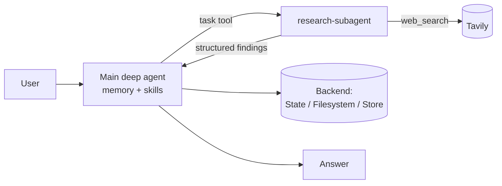

# Deep Agents Research Assistant

A multi-agent chatbot built on **[LangChain Deep Agents](https://github.com/langchain-ai/deepagents)** and **LangGraph**, with a **Streamlit** UI. A main agent plans the work and can hand research off to a dedicated **research subagent** that searches the web with **Tavily** and, optionally, returns **structured Pydantic output** (summary, confidence score, source URLs).

The app pulls together the four notebooks in this repo into one chat interface where every feature can be switched on from the sidebar.

## Features

| Feature | How it works | Notebook |
|---|---|---|
| Deep agent with tools | `create_deep_agent(model, tools, system_prompt)` with a Tavily `web_search` tool | `1-basic.ipynb` |
| Pluggable storage backends | `StateBackend` (ephemeral, in graph state), `FilesystemBackend` (sandboxed disk), `StoreBackend` (LangGraph store, persists across threads) | `2-backends.ipynb` |
| Context engineering | Loads `projects/Agents.md` as durable memory and 4 skill packs from `skills/` (progressive disclosure); per-thread memory via a `MemorySaver` checkpointer | `3-context-enginneering.ipynb` |
| Subagent delegation | Main agent delegates to `research-subagent` through the `task` tool; optional `response_format` for structured results | `4-subagents.ipynb` |
| Agent trace | Each tool call and subagent hand-off is shown in an expandable trace | `app.py` |



## Repo layout

```
app.py                         # Streamlit chat app (all features, sidebar-configurable)
1-basic.ipynb                  # deep agent + Tavily tool
2-backends.ipynb               # State / Filesystem / Store backends
3-context-enginneering.ipynb   # memory (Agents.md), skills, checkpointer threads
4-subagents.ipynb              # subagents + structured output
youtube-chatbot.ipynb          # RAG over YouTube transcripts (OpenAI embeddings + FAISS)
projects/Agents.md             # durable memory injected into the agent
skills/                        # python, langgraph, docker, report-writing skill packs
```

## Run it

```bash
git clone https://github.com/rohitpawar7711/deep-agents.git
cd deep-agents
python -m venv .venv && source .venv/bin/activate
pip install -r requirements.txt
cp .env.example .env          # add OPENAI_API_KEY and TAVILY_API_KEY
streamlit run app.py
```

**Models:** OpenAI GPT models are the default. A Groq option (`openai/gpt-oss-120b`) is included, but a deep-agent request with memory and skills runs to about 24k tokens, which exceeds the 8k tokens-per-minute limit on Groq's free tier, so it needs a paid Groq plan.

## Tech stack

Python · LangChain Deep Agents · LangGraph · LangChain · Pydantic · Tavily · OpenAI · Groq · Streamlit
