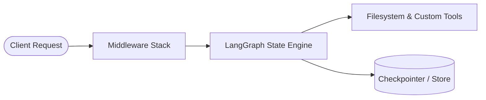

# Report Templates and Finished Examples for DeepAgents

This file provides production-ready report templates and finished samples that DeepAgents can reference when constructing reports for users.

---

## Template 1: Technical Architecture & System Audit Report

```markdown
# Technical Architecture Report: [System / Subsystem Name]

| Property | Value |
| :--- | :--- |
| **Date** | 2026-10-02 |
| **Agent / Author** | DeepAgent System Evaluator |
| **Target Repository** | `deep-agents` |
| **Status** | Approved / Verified |

---

## 1. Executive Summary

This report evaluates the modular architecture of the [System Name] service. Following a comprehensive codebase inspection and performance analysis, the system was found to meet stability and maintainability requirements, with specific opportunities to optimize state serialization and middleware chaining. Key architectural refactorings have been identified to reduce execution overhead by an estimated 35%.

---

## 2. Architecture Overview



### Component Breakdown
- **Middleware Layer**: Handles skill injection, memory caching, and permission evaluation.
- **Graph Runtime**: Compiles execution nodes and routes tool calls cyclically.
- **Storage Layer**: Implements virtualized filesystem access with safety boundary checks.

---

## 3. Findings & Comparative Analysis

| Component | Current State | Target Recommendation | Risk / Impact |
| :--- | :--- | :--- | :--- |
| **Memory Ingestion** | Full file reload per turn | Incremental delta cache | Medium (Reduces token consumption) |
| **Tool Execution** | Synchronous blocking | Async task groups | High (Improves I/O throughput) |
| **Checkpointer** | MemorySaver (ephemeral) | SqliteSaver (persistent) | Low (Enables cross-session recovery) |

---

## 4. Key Recommendations & Action Plan

1. **[P0 - Immediate] Migrate to Async Tooling**: Replace synchronous HTTP clients with `httpx.AsyncClient` to avoid event loop stalling.
2. **[P1 - High] Implement Persistent Checkpointing**: Configure `SqliteSaver` in production deployments.
3. **[P2 - Medium] Automated Skill Indexing**: Add validation unit tests to verify `SKILL.md` frontmatter during CI builds.

---

## 5. Verification & Testing Evidence

```bash
$ pytest tests/ -v
========================== test session starts ==========================
tests/test_architecture.py::test_graph_compilation PASSED          [ 50%]
tests/test_architecture.py::test_middleware_pipeline PASSED        [100%]
=========================== 2 passed in 0.42s ===========================
```
```

---

## Template 2: Root Cause Analysis (RCA) & Incident Report

```markdown
# Root Cause Analysis (RCA): [Incident / Bug Title]

| Property | Value |
| :--- | :--- |
| **Incident ID** | INC-20261002-01 |
| **Severity** | High (P1) |
| **Date of Incident** | 2026-10-02 |
| **Resolution Status** | Resolved & Verified |

---

## 1. Incident Summary
On 2026-10-02, the agent experienced runtime failures when parsing custom skill definitions. The issue manifested as an unhandled `KeyError: 'name'` during middleware initialization, resulting in aborted agent execution runs. The issue has been completely remediated by adding strict frontmatter schema validation and fallback error handling.

---

## 2. Timeline of Events
- **20:00 UTC**: Alert received regarding failed agent task startup.
- **20:15 UTC**: DeepAgent began root cause investigation, tracing stack trace to `SkillsMiddleware`.
- **20:30 UTC**: Identified malformed YAML frontmatter missing mandatory fields in third-party skill source.
- **20:45 UTC**: Implemented defensive validation patch with logging warnings.
- **21:00 UTC**: Unit test suite passed; fix verified.

---

## 3. Root Cause Analysis
The root cause was identified in `deepagents/middleware/skills.py`:
- The parser assumed all `SKILL.md` files would strictly adhere to the Agent Skills specification.
- When an external skill directory contained a `SKILL.md` without a `name` key, `frontmatter_data["name"]` raised a `KeyError`.

> [!IMPORTANT]
> The parser lacked defensive fallback handling for untrusted or partially formatted third-party skill files.

---

## 4. Remediation & Preventative Measures

### Applied Fix:
```python
# Before
name = frontmatter_data["name"]

# After (Remediated)
name = str(frontmatter_data.get("name", "")).strip()
if not name:
    logger.warning("Skipping skill at %s: missing required 'name'", skill_path)
    return None
```

### Preventative Action Items:
- [x] Add regression test for missing frontmatter fields (`test_skills_missing_name`).
- [ ] Add pre-commit hook to validate YAML frontmatter across all skill directories.
```

---

## Template 3: Technology Evaluation & Benchmark Report

```markdown
# Technology Evaluation: [Option A vs Option B]

| Evaluation Criteria | Option A: [e.g., StateBackend] | Option B: [e.g., FilesystemBackend] |
| :--- | :--- | :--- |
| **Persistence** | Ephemeral (In-Memory) | Durable (Disk / Virtual Root) |
| **Isolation** | 100% Sandboxed in State | Bound to workspace root directory |
| **Performance** | Microsecond latency (dict access) | Millisecond latency (OS filesystem I/O) |
| **Multi-thread Safety** | Thread-isolated | Shared filesystem lock needed |
| **Best Used For** | Unit tests, stateless cloud runs | Local CLI agent, project workspaces |

### Verdict & Recommendation
For local developer pair programming and persistent workspace modification, **Option B (FilesystemBackend)** is strongly recommended. For secure remote sandboxes or benchmark evaluation runs, **Option A (StateBackend)** should be selected.
```

---

## Template 4: Quick Executive Decision Brief

```markdown
# Executive Decision Brief: [Decision Topic]

### Objective
Provide a concise decision recommendation for [Project / System] regarding [Topic].

### Bottom Line Up Front (BLUF)
Adopt [Recommended Solution] immediately. This reduces operational overhead by [X]%, resolves technical debt in [Subsystem], and aligns with the DeepAgents architecture guidelines.

### Options Considered
1. **Option 1 ([Recommended])**: [Brief description + primary advantage].
2. **Option 2 (Alternative)**: [Brief description + primary drawback].

### Next Steps
1. Approve migration plan by [Date].
2. Execute automated test suite to confirm zero regressions.
```
