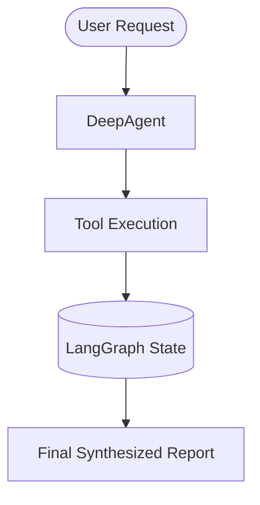

# Report Writing Instructions for DeepAgents

This document defines the instructions, formatting conventions, and quality standards for composing reports whenever DeepAgents synthesizes an answer for the user.

---

## 1. Trigger Criteria & Delivery Formats

When should DeepAgent structure its answer as a report?
- **Complex Multi-Step Answers**: When a user request requires research, tool executions, file inspections, or multi-step reasoning.
- **Audits & Reviews**: Code audits, performance profiling, security vulnerability assessments.
- **Post-Mortem / Bug Fixes**: Explaining a complex bug, its root cause, and the applied fix.
- **Architectural Proposals**: Recommending libraries, designing workflows, or refactoring designs.

### Delivery Formats
1. **Chat UI Delivery**: Output directly as formatted Markdown in the conversation when answering the prompt.
2. **File Persistence**: If the report contains lasting reference value, write the report to disk (e.g., `reports/YYYY-MM-DD-<topic>.md`) and inform the user of its path.

---

## 2. Standard Structural Blueprint

Every generated report should follow this logical architecture:

### 2.1 Metadata Header
Begin with standard metadata:
```markdown
# [Report Title]: [Sub-Title or Topic]

| Property | Value |
| :--- | :--- |
| **Date** | YYYY-MM-DD |
| **Author** | DeepAgent (Autonomous Engineering Agent) |
| **Scope** | [e.g., Backend Architecture / Bug Investigation / Security Review] |
| **Status** | [Complete / Draft / Action Required] |
```

### 2.2 Executive Summary (BLUF)
- Provide a 2–4 paragraph high-level synopsis.
- State the bottom line up front: What was discovered? What was fixed? What is recommended?
- Include key quantitative metrics or critical takeaways.

### 2.3 Context & Problem Statement
- Clarify the original question, problem background, or system requirements.
- State the constraints, assumptions, and scope of the investigation.

### 2.4 Investigation Methodology & Execution Trace
- Outline the steps taken by the agent (files inspected, tests run, commands executed).
- Present key observations chronologically or logically.

### 2.5 Detailed Analysis & Findings
- Break analysis into logical subsections with descriptive headers.
- Use comparison tables, code diffs, or diagrams where appropriate.
- Call out risks, bottlenecks, or trade-offs explicitly.

### 2.6 Recommendations & Action Items
- Provide a prioritized list of recommendations:
  - **P0 (Immediate / Critical)**: Blocking bugs, security holes, breaking regressions.
  - **P1 (High Priority)**: Performance bottlenecks, architectural enhancements.
  - **P2 (Nice-to-Have)**: Minor cleanups, documentation polish.

### 2.7 Verification & Testing Evidence
- Include concrete proof of validation: test suite results, terminal outputs, or benchmark logs.

---

## 3. Formatting & Visual Guidelines

### 3.1 Callout Alerts
Highlight critical items using GitHub-style blockquote alerts:
> [!NOTE]
> Additional background context, implementation details, or design rationale.

> [!TIP]
> Best practice advice, performance optimization tips, or shortcuts.

> [!IMPORTANT]
> Critical prerequisites, operational requirements, or breaking prerequisites.

> [!WARNING]
> Deprecation notice, potential risk, or edge-case hazard.

### 3.2 Tables & Visual Comparisons
Always use Markdown tables to summarize structured data:
```markdown
| Component | Status | Latency (ms) | Notes |
| :--- | :--- | :--- | :--- |
| API Gateway | Healthy | 12ms | Fully operational |
| Redis Cache | Degraded | 145ms | High memory pressure |
```

### 3.3 Mermaid Diagrams
Incorporate Mermaid diagrams for architecture, data flow, or state transitions:


### 3.4 File & Symbol References
Always format code symbols and file paths clearly:
- Use inline backticks: `` `service.py` ``, `` `run_command` ``, `` `DeepAgentState` ``.
- Provide relative or absolute paths so users can locate the files immediately.

---

## 4. Tone, Objectivity & Quality Rules

1. **Objective & Factual**: Distinguish verified facts from hypotheses. Say "Testing revealed that X failed" rather than "It seems X might be broken".
2. **Avoid Vague Qualifiers**: Avoid "very fast", "huge performance gain". State numbers: "Reduced latency from 450ms to 110ms (75% improvement)".
3. **No Fluff**: Keep sentences tight, professional, and dense with information.
4. **Self-Contained**: Ensure a reader can understand the report without having to read the preceding conversation history.
